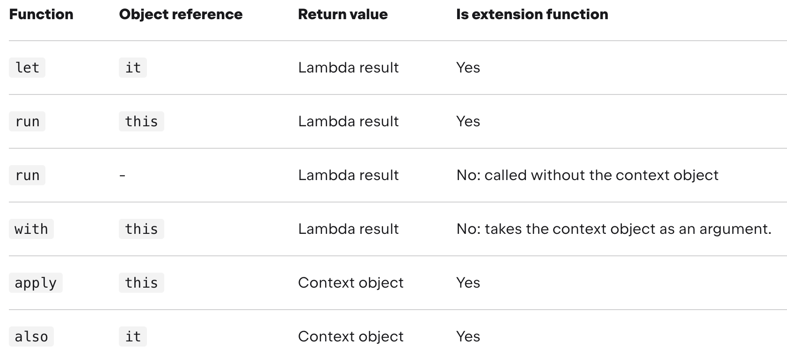

## Scope functions

The Kotlin standard library contains several functions whose sole purpose is to execute a block of code within the
context of an object. When you call such a function on an object with a lambda expression provided, it forms a temporary
scope. In this scope, you can access the object without its name. Such functions are called scope functions. There are
five of them: `let`, `run`, `with`, `apply`, and `also`.

```
val alice = Person("Alice", 20, "Amsterdam")
println(alice)
alice.moveTo("London")
alice.incrementAge()
println(alice)

==>

Person("Alice", 20, "Amsterdam").let {
    println(it)
    it.moveTo("London")
    it.incrementAge()
    println(it)
}
```

The scope functions do not introduce any new technical capabilities, but they can make your code more concise and
readable.

### Function selection



Here is a short guide for choosing scope functions depending on the intended purpose:

* Executing a lambda on non-null objects: let
* Introducing an expression as a variable in local scope: let
* Object configuration: apply
* Object configuration and computing the result: run
* Running statements where an expression is required: non-extension run
* Additional effects: also
* Grouping function calls on an object: with

The use cases of different functions overlap, so that you can choose the functions based on the specific conventions
used in your project or team.

Although the scope functions are a way of making the code more concise, avoid overusing them: it can decrease your code
readability and lead to errors. Avoid nesting scope functions and be careful when chaining them

### Distinctions

here are two main differences between each scope function:

* The way to refer to the context object.
    * each scope function uses one of two ways to access the context object: as a lambda receiver (this) or as a lambda
      argument (it). Both provide the same capabilities
* The return value.

```
fun main() {
    val str = "Hello"
    // this
    str.run {
        println("The string's length: $length")
        //println("The string's length: ${this.length}") // does the same
    }

    // it
    str.let {
        println("The string's length is ${it.length}")
    }
}
```

#### this

run, with, and apply refer to the context object as a lambda receiver - by keyword this.

```
val adam = Person("Adam").apply { 
    age = 20                       // same as this.age = 20
    city = "London"
}
println(adam)
```

#### it

In turn, let and also have the context object as a lambda argument.

```
fun getRandomInt(): Int {
    return Random.nextInt(100).also {
        writeToLog("getRandomInt() generated value $it")
    }
}

val i = getRandomInt()
println(i)
```

#### Return value

* apply and also return the context object.
* let, run, and with return the lambda result.

##### Context object

apply and also

```
val numberList = mutableListOf<Double>()
numberList.also { println("Populating the list") }
    .apply {
        add(2.71)
        add(3.14)
        add(1.0)
    }
    .also { println("Sorting the list") }
    .sort()
    
*****

fun getRandomInt(): Int {
    return Random.nextInt(100).also {
        writeToLog("getRandomInt() generated value $it")
    }
}

val i = getRandomInt()
```

##### Lambda result

let, run, and with return the lambda result. So, you can use them when assigning the result to a variable, chaining
operations on the result, and so on.

```
val numbers = mutableListOf("one", "two", "three")
val countEndsWithE = numbers.run { 
    add("four")
    add("five")
    count { it.endsWith("e") }
}
println("There are $countEndsWithE elements that end with e.")

***

val numbers = mutableListOf("one", "two", "three")
with(numbers) {
    val firstItem = first()
    val lastItem = last()        
    println("First item: $firstItem, last item: $lastItem")
}
```

### Functions

#### let

The context object is available as an argument (it). The return value is the lambda result. let can be used to invoke
one or more functions on results of call chains.

```
val numbers = mutableListOf("one", "two", "three", "four", "five")
val resultList = numbers.map { it.length }.filter { it > 3 }
println(resultList)   

==>

val numbers = mutableListOf("one", "two", "three", "four", "five")
numbers.map { it.length }.filter { it > 3 }.let { 
    println(it)
    // and more function calls if needed
} 

***
val numbers = mutableListOf("one", "two", "three", "four", "five")
numbers.map { it.length }.filter { it > 3 }.let(::println)
```

let is often used for executing a code block only with non-null values. To perform actions on a non-null object, use the
safe call operator ?. on it and call let with the actions in its lambda.

```
val str: String? = "Hello"   
//processNonNullString(str)       // compilation error: str can be null
val length = str?.let { 
    println("let() called on $it")        
    processNonNullString(it)      // OK: 'it' is not null inside '?.let { }'
    it.length
}
```

Another case for using let is introducing local variables with a limited scope for improving code readability. To define
a new variable for the context object, provide its name as the lambda argument so that it can be used instead of the
default it.

```
val numbers = listOf("one", "two", "three", "four")
val modifiedFirstItem = numbers.first().let { firstItem ->
    println("The first item of the list is '$firstItem'")
    if (firstItem.length >= 5) firstItem else "!" + firstItem + "!"
}.uppercase()
println("First item after modifications: '$modifiedFirstItem'")
```

#### with

A non-extension function: the context object is passed as an argument, but inside the lambda, it's available as a
receiver (this). The return value is the lambda result.

We recommend with for calling functions on the context object without providing the lambda result. In the code, with can
be read as "with this object, do the following."

```
val numbers = mutableListOf("one", "two", "three")
with(numbers) {
    println("'with' is called with argument $this")
    println("It contains $size elements")
}
```

Another use case for with is introducing a helper object whose properties or functions will be used for calculating a
value.

```
val numbers = mutableListOf("one", "two", "three")
val firstAndLast = with(numbers) {
    "The first element is ${first()}," +
    " the last element is ${last()}"
}
println(firstAndLast)
```

#### run

The context object is available as a receiver (this). The return value is the lambda result. run does the same as with
but invokes as let - as an extension function of the context object.

run is useful when your lambda contains both the object initialization and the computation of the return value.

```
val service = MultiportService("https://example.kotlinlang.org", 80)

val result = service.run {
    port = 8080
    query(prepareRequest() + " to port $port")
}

// the same code written with let() function:
val letResult = service.let {
    it.port = 8080
    it.query(it.prepareRequest() + " to port ${it.port}")
}
```

Besides calling run on a receiver object, you can use it as a non-extension function. Non-extension run lets you execute
a block of several statements where an expression is required.

```
val hexNumberRegex = run {
    val digits = "0-9"
    val hexDigits = "A-Fa-f"
    val sign = "+-"

    Regex("[$sign]?[$digits$hexDigits]+")
}

for (match in hexNumberRegex.findAll("+123 -FFFF !%*& 88 XYZ")) {
    println(match.value)
}
```

#### apply

The context object is available as a receiver (this). The return value is the object itself. Use apply for code blocks
that don't return a value and mainly operate on the members of the receiver object. The common case for apply is the
object configuration. Such calls can be read as "apply the following assignments to the object."

```
val adam = Person("Adam").apply {
    age = 32
    city = "London"        
}
println(adam)
```

#### also

The context object is available as an argument (it). The return value is the object itself. also is good for performing
some actions that take the context object as an argument. Use also for actions that need a reference to the object
rather than its properties and functions, or when you don't want to shadow the this reference from an outer scope.

When you see also in the code, you can read it as "and also do the following with the object."

```
val numbers = mutableListOf("one", "two", "three")
numbers
    .also { println("The list elements before adding new one: $it") }
    .add("four")
```

### takeIf and takeUnless

In addition to scope functions, the standard library contains the functions takeIf and takeUnless. These functions let
you embed checks of the object state in call chains.

When called on an object with a predicate provided, takeIf returns this object if it matches the predicate. Otherwise,
it returns null. So, takeIf is a filtering function for a single object. In turn, takeUnless returns the object if it
doesn't match the predicate and null if it does. The object is available as a lambda argument (it).

```
val number = Random.nextInt(100)

val evenOrNull = number.takeIf { it % 2 == 0 }
val oddOrNull = number.takeUnless { it % 2 == 0 }
println("even: $evenOrNull, odd: $oddOrNull")
```

When chaining other functions after takeIf and takeUnless, don't forget to perform the null check or the safe call (?.)
because their return value is nullable.

```
val str = "Hello"
val caps = str.takeIf { it.isNotEmpty() }?.uppercase()
//val caps = str.takeIf { it.isNotEmpty() }.uppercase() //compilation error
println(caps)

****
fun displaySubstringPosition(input: String, sub: String) {
    input.indexOf(sub).takeIf { it >= 0 }?.let {
        println("The substring $sub is found in $input.")
        println("Its start position is $it.")
    }
}

displaySubstringPosition("010000011", "11")
displaySubstringPosition("010000011", "12")

Wihtou scope function ==>

fun displaySubstringPosition(input: String, sub: String) {
    val index = input.indexOf(sub)
    if (index >= 0) {
        println("The substring $sub is found in $input.")
        println("Its start position is $index.")
    }
}

displaySubstringPosition("010000011", "11")
displaySubstringPosition("010000011", "12")
```
