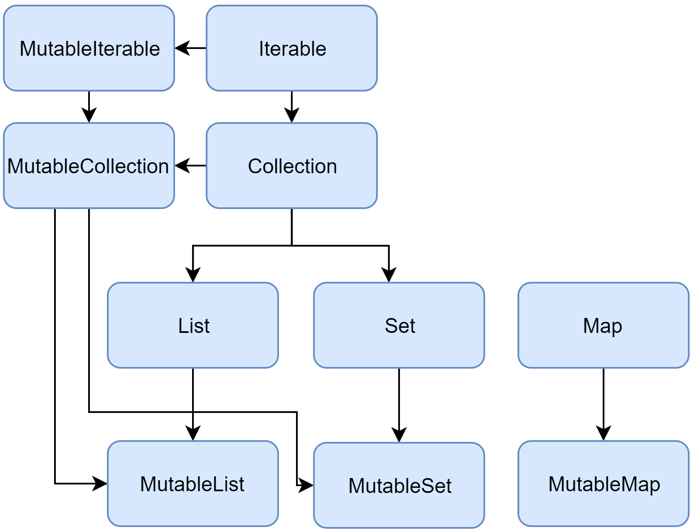

The Kotlin Standard Library provides a comprehensive set of tools for managing collections – groups of a variable number
of items (possibly zero) that are significant to the problem being solved and are commonly operated on.

A collection usually contains a number of objects (this number may also be zero) of the same type. Objects in a
collection are called elements or items. For example, all the students in a department form a collection that can be
used to calculate their average age.

The following collection types are relevant for Kotlin:

* List is an ordered collection with access to elements by indices – integer numbers that reflect their position.
  Elements can occur more than once in a list. An example of a list is a telephone number: it's a group of digits, their
  order is important, and they can repeat.
* Set is a collection of unique elements. It reflects the mathematical abstraction of set: a group of objects without
  repetitions. Generally, the order of set elements has no significance. For example, the numbers on lottery tickets
  form a set: they are unique, and their order is not important.
* Map (or dictionary) is a set of key-value pairs. Keys are unique, and each of them maps to exactly one value. The
  values can be duplicates. Maps are useful for storing logical connections between objects, for example, an employee's
  ID and their position.

Kotlin lets you manipulate collections independently of the exact type of objects stored in them. In other words, you
add a String to a list of Strings the same way as you would do with Ints or a user-defined class. So, the Kotlin
Standard Library offers generic interfaces, classes, and functions for creating, populating, and managing collections of
any type.

## Collection types

The Kotlin Standard Library provides implementations for basic collection types: sets, lists, and maps. A pair of
interfaces represent each collection type:

* A read-only interface that provides operations for accessing collection elements.
* A mutable interface that extends the corresponding read-only interface with write operations: adding, removing, and
  updating its elements.

Note that altering a mutable collection doesn't require it to be a var: write operations modify the same mutable
collection object, so the reference doesn't change. Although, if you try to reassign a val collection, you'll get a
compilation error.

```
val numbers = mutableListOf("one", "two", "three", "four")
numbers.add("five")   // this is OK
println(numbers)
//numbers = mutableListOf("six", "seven")      // compilation error
```

The read-only collection types are covariant. This means that, if a Rectangle class inherits from Shape, you can use a
List<Rectangle> anywhere the List<Shape> is required. In other words, the collection types have the same subtyping
relationship as the element types. Maps are covariant on the value type, but not on the key type.

In turn, mutable collections aren't covariant; otherwise, this would lead to runtime failures. If MutableList<Rectangle>
was a subtype of MutableList<Shape>, you could insert other Shape inheritors (for example, Circle) into it, thus
violating its Rectangle type argument.



## Collection

Collection inherits from the Iterable<T> interface that defines the operations for iterating elements. You can use
Collection as a parameter of a function that applies to different collection types. For more specific cases, use the
Collection's inheritors:

```
fun printAll(strings: Collection<String>) {
    for(s in strings) print("$s ")
    println()
}
    
fun main() {
    val stringList = listOf("one", "two", "one")
    printAll(stringList)
    
    val stringSet = setOf("one", "two", "three")
    printAll(stringSet)
}
```

MutableCollection<T> is a Collection with write operations, such as add and remove.

```
fun List<String>.getShortWordsTo(shortWords: MutableList<String>, maxLength: Int) {
    this.filterTo(shortWords) { it.length <= maxLength }
    // throwing away the articles
    val articles = setOf("a", "A", "an", "An", "the", "The")
    shortWords -= articles
}

fun main() {
    val words = "A long time ago in a galaxy far far away".split(" ")
    val shortWords = mutableListOf<String>()
    words.getShortWordsTo(shortWords, 3)
    println(shortWords)
}
```

## List

List<T> stores elements in a specified order and provides indexed access to them. Indices start from zero – the index of
the first element – and go to lastIndex which is the (list.size - 1).

```
val numbers = listOf("one", "two", "three", "four")
println("Number of elements: ${numbers.size}")
println("Third element: ${numbers.get(2)}")
println("Fourth element: ${numbers[3]}")
println("Index of element \"two\" ${numbers.indexOf("two")}")
```

List elements (including nulls) can duplicate: a list can contain any number of equal objects or occurrences of a single
object. Two lists are considered equal if they have the same sizes and structurally equal elements at the same
positions.

```
val bob = Person("Bob", 31)
val people = listOf(Person("Adam", 20), bob, bob)
val people2 = listOf(Person("Adam", 20), Person("Bob", 31), bob)
println(people == people2)
bob.age = 32
println(people == people2)
```

MutableList<T> is a List with list-specific write operations, for example, to add or remove an element at a specific
position.

```
val numbers = mutableListOf(1, 2, 3, 4)
numbers.add(5)
numbers.removeAt(1)
numbers[0] = 0
numbers.shuffle()
println(numbers)
```

As you see, in some aspects lists are very similar to arrays. However, there is one important difference: an array's
size is defined upon initialization and is never changed; in turn, a list doesn't have a predefined size; a list's size
can be changed as a result of write operations: adding, updating, or removing elements.

In Kotlin, the default implementation of List is ArrayList which you can think of as a resizable array.

## Set

Set<T> stores unique elements; their order is generally undefined. null elements are unique as well: a Set can contain
only one null. Two sets are equal if they have the same size, and for each element of a set there is an equal element in
the other set

```
val numbers = setOf(1, 2, 3, 4)
println("Number of elements: ${numbers.size}")
if (numbers.contains(1)) println("1 is in the set")

val numbersBackwards = setOf(4, 3, 2, 1)
println("The sets are equal: ${numbers == numbersBackwards}")
```

MutableSet is a Set with write operations from MutableCollection.

The default implementation of Set – LinkedHashSet – preserves the order of elements insertion. Hence, the functions that
rely on the order, such as first() or last(), return predictable results on such sets.

An alternative implementation – HashSet – says nothing about the elements order, so calling such functions on it returns
unpredictable results. However, HashSet requires less memory to store the same number of elements.

## Map

Map<K, V> is not an inheritor of the Collection interface; however, it's a Kotlin collection type as well. A Map stores
key-value pairs (or entries); keys are unique, but different keys can be paired with equal values. The Map interface
provides specific functions, such as access to value by key, searching keys and values, and so on.

```
val numbersMap = mapOf("key1" to 1, "key2" to 2, "key3" to 3, "key4" to 1)

println("All keys: ${numbersMap.keys}")
println("All values: ${numbersMap.values}")
if ("key2" in numbersMap) println("Value by key \"key2\": ${numbersMap["key2"]}")    
if (1 in numbersMap.values) println("The value 1 is in the map")
if (numbersMap.containsValue(1)) println("The value 1 is in the map") // same as previous
```

Two maps containing the equal pairs are equal regardless of the pair order.

MutableMap is a Map with map write operations, for example, you can add a new key-value pair or update the value
associated with the given key.

The default implementation of Map – LinkedHashMap – preserves the order of elements insertion when iterating the map. In
turn, an alternative implementation – HashMap – says nothing about the elements order.

